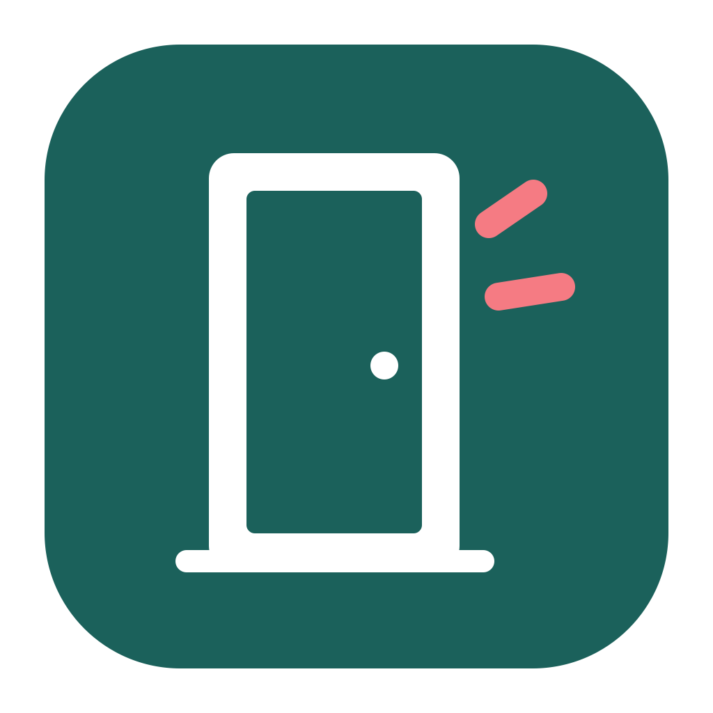
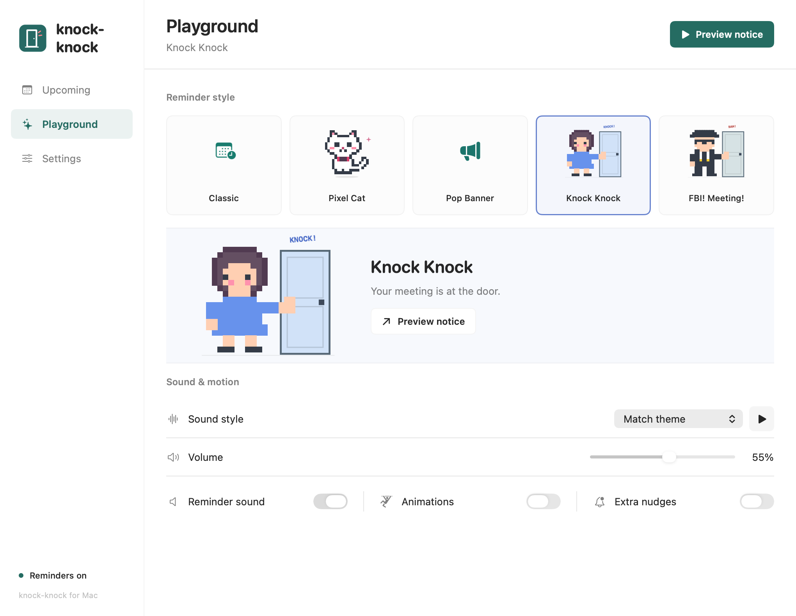
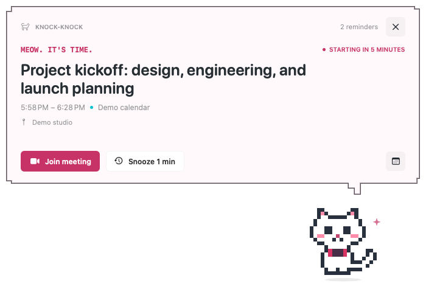
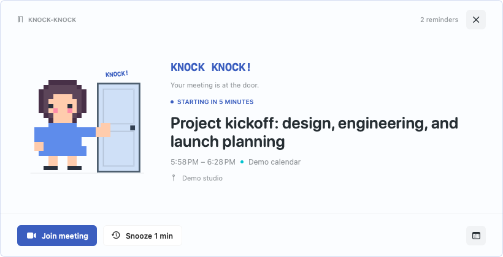

<p align="center"></p>

# knock-knock

A playful macOS calendar reminder that knocks before your next meeting.

[简体中文](README.zh-CN.md) · [Download for Mac](https://github.com/lewislulu/knock-knock/releases/latest) · [Privacy](PRIVACY.md) · [MIT license](LICENSE)



All product images use fictional demo events rendered in an isolated test app. They contain no personal calendars or desktop captures.

## Make the next meeting hard to miss

- **Five personalities:** a pixel cat, a screen-top banner, a girl knocking on a door, a comic FBI-style visitor, and a quiet classic notice.
- **Five original sounds:** chime, arcade, meow, knock, and siren. Match the theme, pick a sound, adjust volume, or stay silent.
- **Your timing:** reminders 1, 3, 5, 10, 15, or 30 minutes early, with snooze, pause, and optional repeat nudges.
- **Native Mac experience:** SwiftUI and AppKit, a menu bar home, calendar filters, meeting links, and optional launch at login.
- **Multilingual:** English, Simplified Chinese, and Japanese, with a system-language option.
- **Local processing:** reads events through Apple's EventKit. No account, analytics, ads, or app backend.





The FBI theme is a fictional visual joke and has no affiliation with any agency.

## Install

**macOS 14 Sonoma or later. The v1.0.0 download is for Apple Silicon (M1 or later) only.** Intel, Windows, and Linux are not supported by this release.

1. Download the `.dmg` from [Releases](https://github.com/lewislulu/knock-knock/releases/latest).
2. Open it and drag **knock-knock** into **Applications**.
3. Open the app, click **Connect Calendar**, and grant Calendar access.
4. Open **Playground** and click **Preview notice** to try it. The calendar-and-clock icon in your Mac's menu bar reopens the app.

This community build is **ad-hoc signed, without an Apple Developer ID or notarization**. macOS may block the first launch. After checking the source of your download, use **System Settings → Privacy & Security → Open Anyway** if that option is available. Managed Macs may disallow it. Do not disable Gatekeeper globally. You can also build from source.

Keep the app running for reminders. It cannot wake a sleeping Mac or show a notice on the lock screen. It checks about every 15 seconds and catches recently started events for up to three minutes after wake or unlock. All-day, canceled, and declined events are skipped. Calendar access is required for real reminders; previews work without it. macOS may ask for Calendar permission again after an ad-hoc update.

## Build from source

On an Apple Silicon Mac with macOS 14+, install Apple's Command Line Tools (`xcode-select --install`). You need `swiftc`, the macOS SDK, and Python 3; there are no package dependencies.

```sh
git clone https://github.com/lewislulu/knock-knock.git
cd knock-knock
bash scripts/build.sh
bash scripts/test.sh
open knock-knock.app
```

Generate an installable disk image:

```sh
bash scripts/package-dmg.sh
```

The DMG and `SHA256SUMS` are written to `dist/`. Builds are ad-hoc signed locally. The build maps source paths to a neutral prefix and strips debug symbols before signing.

## Product images and checks

```sh
bash scripts/render-previews.sh
python3 scripts/product-images.py
```

The visual harness uses a separate bundle identifier and synthetic meetings; it never starts the calendar monitor or requests calendar access. It renders all themes in three languages, the main views at two widths, empty states, and character poses. The exporter removes PNG metadata. Functional checks cover reminder timing, snooze, localization, sounds, and pixel sprites.

Before reporting an issue, remove event names, meeting URLs, calendar accounts, and other personal information from screenshots and logs. See [PRIVACY.md](PRIVACY.md) for data handling and publication details.

## License

[MIT](LICENSE), including the original logo, pixel artwork, and synthesized sounds in this repository.
