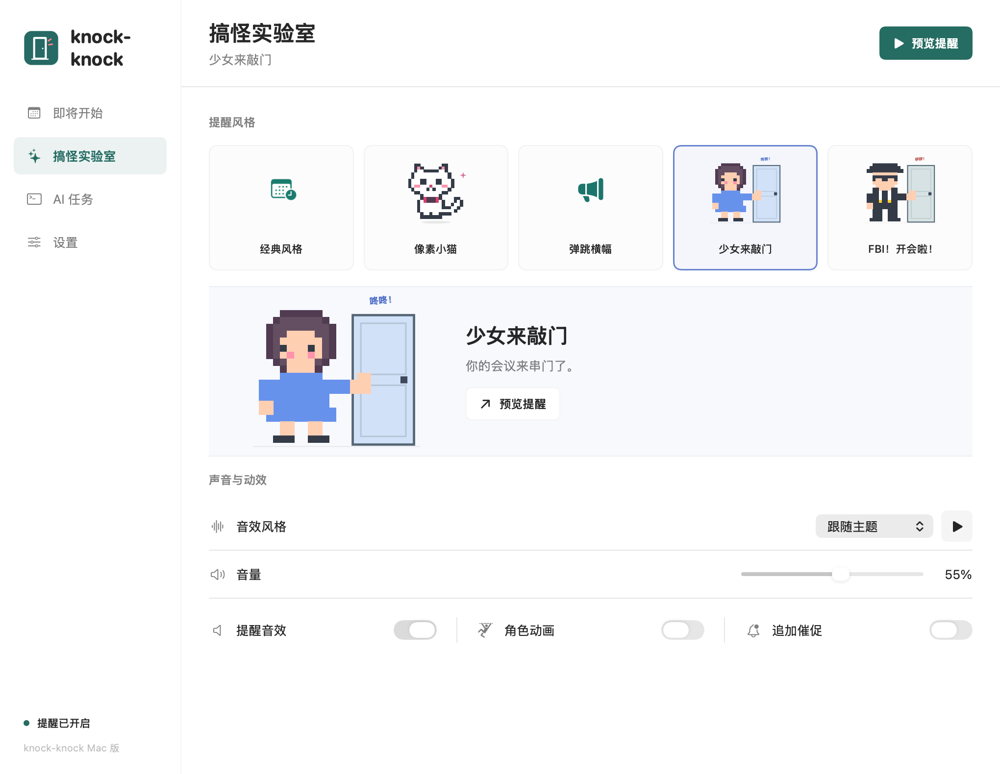
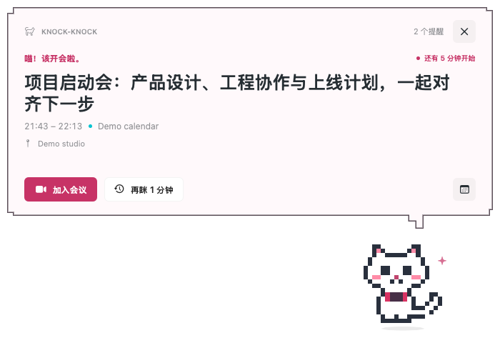

<p align="center"></p>

# knock-knock

会议快开始了？让一只像素猫，或者一位敲门访客，来提醒你。

[English](README.md) · [下载 Mac 版](https://github.com/lewislulu/knock-knock/releases/latest) · [隐私说明](PRIVACY.md) · [MIT 许可证](LICENSE)



所有产品图片均由独立测试程序使用虚构日程生成，不包含真实日历、个人信息或桌面截图。

## 提醒，也可以有点搞怪

- **五种提醒风格：**像素猫、屏幕顶部横幅、女孩敲门、搞怪 FBI 风格访客，以及简洁的经典通知。
- **五种原创音效：**铃声、街机、猫叫、敲门和警笛。可跟随主题、单独选择、调节音量或静音。
- **自己掌握节奏：**提前 1、3、5、10、15 或 30 分钟提醒，支持稍后提醒、暂停和可选的重复提醒。
- **原生 Mac 体验：**使用 SwiftUI、AppKit 和 EventKit，支持菜单栏入口、日历筛选、会议链接及登录时启动。
- **多语言界面：**英语、简体中文和日语，可跟随系统语言。
- **本地处理：**无需注册，没有广告、分析统计或应用后端。



FBI 风格仅为虚构的视觉玩笑，与任何机构无关。

## 安装

**需要 macOS 14 Sonoma 或更新版本。v1.0.0 安装包仅支持 Apple Silicon（M1 及更新芯片）。** 本版本不支持 Intel Mac、Windows 或 Linux。

1. 从 [Releases](https://github.com/lewislulu/knock-knock/releases/latest) 下载 `.dmg` 文件。
2. 打开磁盘映像，将 **knock-knock** 拖入 **Applications（应用程序）**。
3. 启动应用，点击 **连接日历**，在系统提示中允许访问日历。
4. 在外观设置页点击 **预览提醒**。以后可点击 Mac 顶部菜单栏中的日历时钟图标重新打开应用。

当前社区构建使用 **ad-hoc 本地签名，没有 Apple Developer ID 签名，也未经过 Apple 公证**，首次打开可能被 macOS 拦截。确认下载来源可信后，可在 **系统设置 → 隐私与安全性 → 仍要打开** 中放行（如果系统提供该选项）。受管理的 Mac 可能不允许此操作。请勿全局关闭 Gatekeeper；也可以自行编译。

提醒需要应用保持运行。它不会唤醒睡眠中的 Mac，也不会在锁屏上显示通知。应用约每 15 秒检查一次，唤醒或解锁后会补查最近三分钟内开始的日程。全天、已取消或已拒绝的日程会被跳过。真实日程提醒需要日历权限；预览无需授权。更新 ad-hoc 签名的应用后，macOS 可能再次要求日历授权。

## 从源码构建

`feature/agent-completion-reminders` 分支新增本地 Codex、Claude Code 回复完成提醒。接入方式、Hook 信任、会话跳转及隐私说明见 [AI 接入指南](docs/AGENT-INTEGRATIONS.md)。此功能尚未包含在 v1.0.0 下载中。

在运行 macOS 14 或更新版本的 Apple Silicon Mac 上，安装 Apple 命令行工具（`xcode-select --install`）。需要 `swiftc`、macOS SDK 和 Python 3，无第三方包依赖。

```sh
git clone https://github.com/lewislulu/knock-knock.git
cd knock-knock
bash scripts/build.sh
bash scripts/test.sh
open knock-knock.app
```

生成安装包：

```sh
bash scripts/package-dmg.sh
```

DMG 和 `SHA256SUMS` 校验文件位于 `dist/`。构建脚本会替换源码路径前缀、移除调试符号，并进行本地签名。

## 产品图片与验证

```sh
bash scripts/render-previews.sh
python3 scripts/product-images.py
```

视觉测试使用独立的应用标识和虚构日程，不启动日历监控，也不请求日历权限。它会生成三种语言的全部主题、两种窗口宽度的主要页面、空状态及角色姿势，并在导出产品图片时移除 PNG 元数据。功能检查覆盖提醒时间、稍后提醒、本地化、音效和像素角色。

提交问题前，请删除截图或日志中的日程标题、会议链接、日历账户及其他个人信息。数据处理和发布说明见 [PRIVACY.md](PRIVACY.md)。

## 许可证

采用 [MIT 许可证](LICENSE)，包括仓库内的原创标志、像素角色与合成音效。
