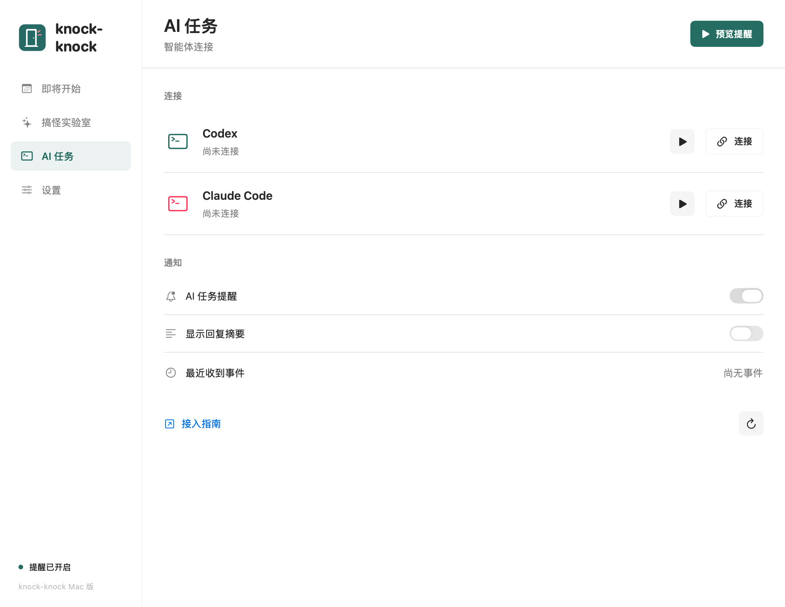
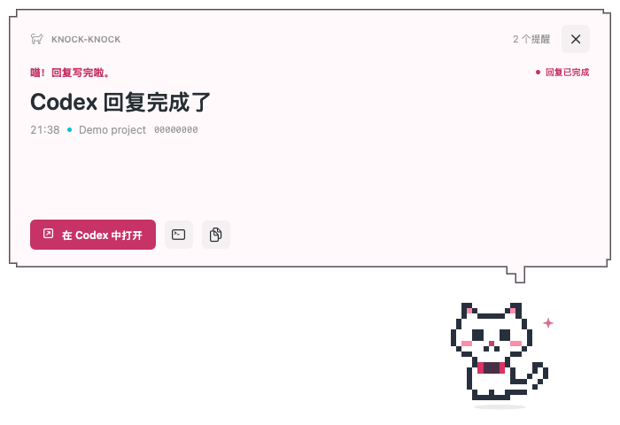

# AI task reminders / AI 任务提醒

This feature is being developed on `feature/agent-completion-reminders`. It is not included in v1.0.0.





## 简体中文

### 能接什么

| 来源 | 完成事件 | 提醒按钮 |
| --- | --- | --- |
| 支持 Hooks 的 Codex 桌面版本，本机任务 | `Stop` | 用 `codex://threads/<id>` 打开对应会话，也可在终端恢复 |
| Codex CLI | `Stop`；兼容旧版 `notify` 的 `agent-turn-complete` | 在 Codex 打开，或执行 `codex resume <id>` |
| Claude Code CLI | `Stop` | 在 Terminal 中执行 `claude --resume <id>` |

这里的“完成”指主智能体结束一轮回复，不代表整个项目已经验证完成，也不代表永久关闭会话。它不会对每条进度消息、工具调用或子智能体结束发出通知。其他 Stop hook 仍可能要求智能体继续，所以通知表示本轮回复已就绪。

普通 Claude 聊天、Claude 网页版没有通过本功能接入。Claude Code 桌面环境仅在其确实执行相同本地 hooks 时可用，未承诺专用桌面会话深链。Codex Cloud、SSH 或远程环境不会自动把远端 hook 发送到本机。旧版 Codex 桌面端如果不执行 hooks，不能靠安装配置解决，需要更新到支持版本。

### 连接

1. 构建本分支，把 `knock-knock.app` 放到固定位置，推荐「应用程序」。运行后打开 **AI 任务**。
2. 点击 Codex 或 Claude Code 旁边的 **连接**。应用会合并自己的 Stop handler，不覆盖其他 hooks，并在原配置目录保留权限为 `0600` 的备份。
3. Codex 必须在 `/hooks` 中查看并信任这个新 hook；桌面端使用其提供的 hook 信任入口，或者在共享同一 `CODEX_HOME` 的 CLI 中完成。配置变化后重新打开任务或重启客户端。应用显示“Hook 已配置”只表示文件已写好，不表示已经通过信任检查。
4. 让智能体完成一轮回复。收到事件后，AI 任务页会显示最近接收时间；旁边的播放按钮可单独预览样式，不运行模型。

应用必须能够在本机启动。无需授予日历权限也可以接收 AI 提醒。全局“暂停提醒”会暂存待通知事件，解锁或恢复后继续显示；超过一小时的积压会丢弃。关闭“AI 任务提醒”会丢弃后续事件和待显示队列。

默认仅显示来源、项目文件夹名称、会话 ID 前八位和接收时间。打开“显示回复摘要”后，后续事件会额外带上最多 240 字符的回复摘录，可能包含敏感信息。关闭它会立刻隐藏当前提醒中的摘录。摘要不会上传到任何服务器。

Codex 的会话跳转要求这条会话存在于接收深链的桌面客户端中；不同 `CODEX_HOME`、远程任务或不同桌面版本可能无法定位。可以使用终端按钮或复制恢复命令。终端恢复会打开新的会话界面，并非聚焦原来的终端 tab；`codex` 或 `claude` 必须在登录 shell 的 PATH 中可用。

### 断开与文件位置

在 **AI 任务** 点击 **断开**，只移除当前应用安装的 handler。请先断开再移动或删除应用，以免配置仍指向旧路径。

- Codex：`~/.codex/hooks.json`；应用进程存在 `CODEX_HOME` 环境变量时使用它。
- Claude Code：`~/.claude/settings.json`；应用进程存在 `CLAUDE_CONFIG_DIR` 时使用它。
- 从 Finder 启动的应用通常不继承终端中的自定义环境变量；自定义目录用户应使用下面的手工配置。
- 本地传递队列：`~/Library/Application Support/knock-knock/AgentInbox`，目录权限 `0700`，消息文件 `0600`，消费后删除。
- 终端恢复脚本：同级 `Resume` 目录，权限 `0700`，只包含项目路径和安全引用的恢复命令，最多保留 30 份。
- 去重记录：应用偏好设置中保存一天内的事件摘要标识与时间，不保存回复正文。Claude Stop 没有稳定的 turn ID，因此每次 Stop 被视为新事件；不要重复配置同一个 handler。

卸载后可以删除 `~/Library/Application Support/knock-knock`。应用停止期间，未消费的队列文件仍在本机，重新启动时会删除过期消息。

## English

The bridge listens for the main agent's **Stop** event, meaning a reply is ready. It does not assert that the entire project is finished. Other Stop hooks can still ask the agent to continue. Progress messages, tool calls, interrupts, and subagent completion are ignored.

Install this branch's app in a stable location, open **AI Tasks**, and connect Codex or Claude Code. Existing settings and hooks are preserved, with a private backup beside the original configuration. **Codex hooks require review and trust in `/hooks`** before they run. Restart the client or reopen the task after configuration changes. “Hook configured” means the handler exists, not that trust or delivery has been verified. The last-event time confirms receipt.

Codex desktop support requires a version that executes local lifecycle hooks. The current installed desktop code exposes `codex://threads/<id>`; that deep-link format is a compatibility detail, not a guaranteed public API. It can only find sessions available to that desktop client. The CLI alternative runs `codex resume <id>`. Claude Code runs `claude --resume <id>` in a new Terminal window. This does not focus the original terminal tab. Both CLIs must be available on the login shell's PATH.

Ordinary Claude chat is not supported. Claude Code desktop environments must actually execute the same local hooks; no dedicated Claude desktop deep link is assumed. Cloud, SSH, and remote tasks do not automatically forward events to this Mac.

Reminders use the selected theme and sound, without requiring Calendar permission. Pause and lock defer delivery; events older than one hour are discarded. Disabling agent reminders discards pending/new events. Excerpts are **off by default**, and when enabled contain at most 240 characters of the final reply. Prompts and transcripts are never read or forwarded. Local metadata includes the source, session ID, project directory, timestamp, and optional excerpt. The transport is a private filesystem queue, with no network listener. Consumed files are removed, and only hashed event IDs and times remain for one-day deduplication. Codex turn IDs suppress repeat notifications, including legacy notify events for the same turn. Claude Stop does not supply a stable turn ID, so every invocation is a new event; configure one handler only.

The app honors `CODEX_HOME` and `CLAUDE_CONFIG_DIR` only when those variables are present in its own process environment. Finder launches usually don't inherit shell variables. Use manual configuration for custom homes. Disconnect before moving/deleting the app. Generated resume scripts retain up to 30 directory/session pairs in the private `Resume` folder; deleting the app's Application Support folder removes them and any queued data.

## Manual configuration

Merge this into Codex `hooks.json` or Claude Code `settings.json`, using `--source codex` or `--source claude` respectively. Do not overwrite an existing file. The helper is bundled with the app, so no Python runtime or package installation is needed.

```json
{
  "hooks": {
    "Stop": [
      {
        "hooks": [
          {
            "type": "command",
            "command": "'/Applications/knock-knock.app/Contents/Resources/knock-notify' --source codex",
            "timeout": 5
          }
        ]
      }
    ]
  }
}
```

For older Codex CLI versions with `notify`, add this **at the top level** of `config.toml`, before any table headers. Use either Stop or notify, not both, and preserve any existing notification integration.

```toml
notify = ["/Applications/knock-knock.app/Contents/Resources/knock-notify", "--source", "codex"]
```

The helper accepts one legacy JSON argument or hook JSON on stdin, always returns exit 0 with `{}`, and never changes the agent's stopping decision. Invalid, oversized, and unrelated payloads are discarded without logging their contents.

## Verification

`bash scripts/test.sh` covers both payload formats, subprocess stdin delivery, local file permissions, malformed inputs, privacy defaults, duplicate handling, expiration, paused/disabled delivery, config preservation, and shell quoting. `bash scripts/render-previews.sh` renders fictional agent reminders in all themes and three languages, plus the AI Tasks page at two widths. No real model calls, transcript reads, or personal configuration changes are performed by these tests. Live hook execution and desktop navigation depend on the user's installed client and hook trust and must be checked after connecting.

## References

- [Official Codex hooks](https://learn.chatgpt.com/docs/hooks)
- [Codex notify configuration](https://learn.chatgpt.com/docs/config-file/config-advanced#notifications)
- [Claude Code hook reference](https://code.claude.com/docs/en/hooks)
